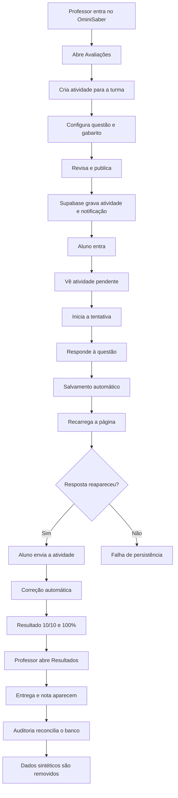
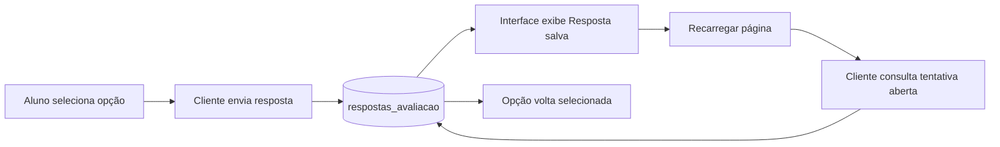
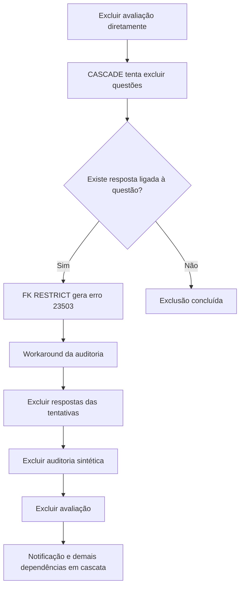

# Auditoria de fluxo do aluno — OminiSaber

**Identificação:** OMNI-AUD-FLU-ALU-001  
**Data de execução:** 27/09/2026  
**Ambiente:** aplicação local em `http://127.0.0.1:4173`, integrada ao Supabase configurado no projeto  
**Responsável pela execução:** Codex  
**Estado:** concluída  
**Parecer:** aprovado com ressalvas para demonstração MVP

## 1. Objetivo

Validar o caminho principal entre professor e aluno, desde a criação e publicação de uma atividade até a entrega, correção automática e conferência pelo professor. A auditoria também cobre persistência da resposta, notificação interna, separação de perfis, navegação das áreas principais do aluno, responsividade e limpeza dos dados sintéticos gerados pelo próprio teste.

Este documento concentra o plano executado, os resultados, os defeitos e pontos anti-intuitivos, as evidências visuais, os fluxogramas e o parecer de qualidade, conforme o padrão dos documentos `OMNI-TEC-TST-001` a `OMNI-TEC-TST-004`.

## 2. Escopo e limites

### Incluído

- autenticação de professor e aluno;
- criação de atividade objetiva pelo professor;
- associação à turma `1º Ano A · Informática`;
- publicação e geração de notificação;
- descoberta da atividade no painel e na central de atividades do aluno;
- início da tentativa;
- resposta e salvamento automático;
- recarga da página e recuperação da resposta;
- envio, correção automática, nota e resultado;
- conferência da entrega na visão do professor;
- bloqueio de acesso de aluno a rota de professor;
- smoke test das áreas principais do aluno;
- desktop, celular de 390 × 844 e tablet de 768 × 1024;
- verificadores automatizados do módulo;
- reconciliação e limpeza no Supabase.

### Não incluído nesta rodada

- certificação exaustiva de cada ação interna de Trilhas, Biblioteca, Redação, Perfil e Suporte;
- entrega real de push pelo sistema operacional com o site fechado;
- testes em aparelhos físicos, navegadores Safari/Firefox ou rede instável;
- matriz completa de todas as políticas RLS do banco;
- exclusão de dados demonstrativos preexistentes sem identificação inequívoca de origem.

Registros preexistentes do projeto foram preservados. Somente os dados sintéticos criados nesta auditoria, identificados pelo prefixo `[AUDITORIA E2E]`, foram removidos.

## 3. Dados de teste

| Item | Valor usado |
|---|---|
| Professor | matrícula `userprofportugues` |
| Aluno | matrícula `useraluno` |
| Turma | 1º Ano A · Informática |
| Atividade | `[AUDITORIA E2E] Fluxo aluno 2026-09-27` |
| Tipo | questão de múltipla escolha |
| Valor | 10 pontos |
| Resposta correta | “A posição central defendida pelo autor.” |
| Resultado esperado | 10/10 e 100% |

Senhas e chaves de infraestrutura não são reproduzidas neste relatório.

## 4. Fluxo executado



### Persistência da resposta



### Separação de perfis

```mermaid
flowchart TD
    A[Aluno autenticado] --> B[Tenta abrir rota /professor/...]
    B --> C{Papel autorizado?}
    C -- Não --> D[/erro?code=forbidden]
    D --> E[Mensagem de permissão insuficiente]
```

## 5. Casos de teste e resultado

| ID | Risco | Caso | Pré-condição | Resultado esperado | Resultado observado | Estado |
|---|---|---|---|---|---|---|
| CT-AUTH-001 | Alto | Autenticar professor e aluno | contas de teste ativas | cada perfil entra em sua área | ambos autenticados corretamente | Aprovado |
| CT-AUTH-002 | Alto | Aluno tenta acessar rota docente | aluno autenticado | acesso negado | redirecionamento para `erro?code=forbidden` | Aprovado |
| CT-ATV-001 | Alto | Criar e publicar atividade | professor e turma vinculados | atividade publicada e visível para a turma | publicada e exibida ao aluno | Aprovado |
| CT-ATV-002 | Alto | Responder com salvamento automático | tentativa iniciada | resposta persistida sem envio final | “Resposta salva” e opção restaurada após recarga | Aprovado |
| CT-ATV-003 | Crítico | Enviar e corrigir questão objetiva | resposta correta salva | entrega final, nota 10 e 100% | tentativa `corrigida`, nota 10, 100% | Aprovado |
| CT-ATV-004 | Alto | Professor confere a entrega | atividade entregue | aluno, nota e situação na visão docente | Ana Clara, 10.00, Corrigida | Aprovado |
| CT-NOT-001 | Médio | Notificação interna da publicação | atividade publicada | aviso disponível ao aluno | “Nova atividade disponível” exibida com link | Aprovado |
| CT-SMK-001 | Médio | Abrir áreas principais do aluno | aluno autenticado | página carrega sem erro bloqueante | Trilhas, Evolução, Biblioteca, Notificações, Agenda, Perfil, Ajuda e Redação abriram | Aprovado |
| CT-UI-001 | Alto | Resultado em celular e tablet | atividade concluída | conteúdo utilizável sem perda do resultado | validado em 390 × 844 e 768 × 1024 | Aprovado |
| CT-DATA-001 | Alto | Remover dados sintéticos | teste concluído | nenhum registro de auditoria restante | zero atividades, tentativas, respostas, auditorias e notificações com o prefixo | Aprovado com workaround |

## 6. Reconciliação no Supabase

Antes da limpeza, a consulta administrativa confirmou:

- atividade publicada, valor 10;
- uma tentativa do aluno em estado `corrigida`;
- pontuação automática 10, manual 0 e nota final 10;
- resposta marcada como correta;
- eventos de auditoria `publicada` e `entregue`;
- notificação interna vinculada à avaliação.

Após a limpeza controlada:

```json
{
  "activities": [],
  "attempts": [],
  "answers": [],
  "audit": [],
  "notifications": []
}
```

A limpeza removeu uma atividade, uma tentativa respondida e as dependências sintéticas vinculadas. A imagem 30 confirma também que a atividade não aparece mais na central do aluno.

## 7. Verificadores automatizados

| Verificador | Resultado |
|---|---|
| `activity:builder:check` | Aprovado |
| `activity:student:check` | Aprovado |
| `activity:teacher-review:check` | Aprovado |
| `activity:results:check` | Aprovado |
| `auth:check` | Aprovado com certificados do sistema habilitados |
| `docs:check` | Aprovado — 105 documentos Markdown, 28 controlados |

O verificador de autenticação confirmou cadastro, login por e-mail, login por matrícula, proteção de perfil, papel `aluno`, curso `informatica` e limpeza do usuário temporário criado pelo próprio teste.

## 8. Defeitos e pontos anti-intuitivos

### OMNI-AUD-2026-001 — exclusão direta de avaliação respondida falha por conflito de chaves

| Campo | Registro |
|---|---|
| Severidade | Média |
| Prioridade | Alta para saneamento e manutenção |
| Ambiente | Supabase do projeto, atividade com uma entrega |
| Rota/área | ciclo de vida de avaliações |
| Papel | manutenção administrativa / professor, caso a exclusão seja exposta |
| Reprodução | criar atividade, responder como aluno e tentar excluir diretamente `avaliacoes_docentes` |
| Esperado | exclusão consistente ou bloqueio tratado com mensagem e política explícita |
| Observado | erro PostgreSQL `23503`; uma questão ainda era referenciada por `respostas_avaliacao` |
| Causa provável | `avaliacoes_docentes` exclui questões em cascata, mas `respostas_avaliacao_questao_id_fkey` protege a questão com `RESTRICT` |
| Evidência | saída registrada durante CT-DATA-001 |
| Contorno aplicado | excluir respostas da tentativa, excluir auditoria sintética e só então excluir a avaliação |
| Regressão | limpeza repetida; consulta final retornou zero registros |
| Estado | Aberto no modelo do produto; contornado na ferramenta da auditoria |



**Recomendação:** definir uma política única de retenção. Se entregas precisam ser preservadas, impedir a exclusão e oferecer arquivamento; se a exclusão for permitida, implementar uma função transacional controlada, auditada e testada, em vez de misturar `CASCADE` e `RESTRICT` no mesmo agregado.

### OMNI-AUD-2026-002 — nomenclatura mistura “avaliação” e “atividade” no construtor

| Campo | Registro |
|---|---|
| Severidade | Baixa |
| Prioridade | Média |
| Ambiente | desktop, área do professor de Português |
| Rota/área | Avaliações → Nova avaliação |
| Reprodução | abrir “Nova avaliação” e observar o cabeçalho e o tipo inicial |
| Esperado | linguagem consistente entre avaliação, atividade e trabalho |
| Observado | o fluxo começa como “Nova avaliação”, mas o cabeçalho muda para “Atividades de Português” e o tipo padrão é “Atividade” |
| Impacto | aumenta a dúvida sobre o que está sendo criado e publicado |
| Evidência | `04-professor-criacao-etapa-1-vazia.png` |
| Recomendação | usar “Criar instrumento” com escolha explícita ou manter o mesmo termo durante todo o fluxo |
| Estado | Aberto |

## 9. Evidências visuais

Todas as imagens foram capturadas durante a execução real. As imagens 16 a 19 registram os breakpoints móveis e tablet.

| Nº | Evidência | Rota/condição principal |
|---:|---|---|
| 01 | [Login desktop](./evidencias/01-login-desktop.png) | `/frontend/login/` |
| 02 | [Painel do professor](./evidencias/02-professor-dashboard-desktop.png) | dashboard docente |
| 03 | [Lista de avaliações](./evidencias/03-professor-avaliacoes-lista.png) | avaliações |
| 04 | [Criação — etapa inicial](./evidencias/04-professor-criacao-etapa-1-vazia.png) | nova avaliação |
| 05 | [Seleção curricular](./evidencias/05-professor-curriculo.png) | currículo |
| 06 | [Currículo selecionado](./evidencias/06-professor-curriculo-selecionado.png) | currículo |
| 07 | [Questão configurada](./evidencias/07-professor-questao-configurada.png) | questão e gabarito |
| 08 | [Revisão para publicação](./evidencias/08-professor-revisao-publicacao.png) | revisão |
| 09 | [Atividade publicada](./evidencias/09-professor-atividade-publicada.png) | sucesso da publicação |
| 10 | [Painel do aluno com pendência](./evidencias/10-aluno-dashboard-atividade-pendente.png) | dashboard do aluno |
| 11 | [Central de atividades](./evidencias/11-aluno-lista-atividades.png) | lista do aluno |
| 12 | [Tentativa iniciada](./evidencias/12-aluno-atividade-iniciada.png) | execução |
| 13 | [Resposta salva automaticamente](./evidencias/13-aluno-resposta-autosalva.png) | autosave |
| 14 | [Resposta recuperada após recarga](./evidencias/14-aluno-resposta-recuperada-apos-reload.png) | persistência |
| 15 | [Resultado entregue](./evidencias/15-aluno-atividade-entregue.png) | 10/10 e 100% |
| 16 | [Dashboard em celular](./evidencias/16-aluno-dashboard-mobile-390x844.png) | 390 × 844 |
| 17 | [Atividades em celular](./evidencias/17-aluno-atividades-mobile-390x844.png) | 390 × 844 |
| 18 | [Resultado em celular](./evidencias/18-aluno-resultado-mobile-390x844.png) | 390 × 844 |
| 19 | [Resultado em tablet](./evidencias/19-aluno-resultado-tablet-768x1024.png) | 768 × 1024 |
| 20 | [Professor confirma a entrega](./evidencias/20-professor-verificacao-entrega.png) | resultados docentes |
| 21 | [Trilhas](./evidencias/21-aluno-trilhas-desktop.png) | smoke test |
| 22 | [Evolução](./evidencias/22-aluno-evolucao-desktop.png) | smoke test |
| 23 | [Biblioteca](./evidencias/23-aluno-biblioteca-desktop.png) | smoke test |
| 24 | [Notificações](./evidencias/24-aluno-notificacoes-desktop.png) | aviso da atividade |
| 25 | [Agenda](./evidencias/25-aluno-agenda-desktop.png) | smoke test |
| 26 | [Perfil](./evidencias/26-aluno-perfil-desktop.png) | smoke test |
| 27 | [Ajuda e suporte](./evidencias/27-aluno-ajuda-desktop.png) | smoke test |
| 28 | [Laboratório de redação](./evidencias/28-aluno-redacao-desktop.png) | smoke test |
| 29 | [Bloqueio da área de professor](./evidencias/29-aluno-bloqueio-area-professor.png) | acesso proibido |
| 30 | [Central após limpeza](./evidencias/30-aluno-pos-limpeza-dados-sinteticos.png) | ausência do dado sintético |

## 10. Critérios de qualidade e gate

| Critério | Situação |
|---|---|
| Fluxo crítico professor → aluno → professor | Aprovado |
| Persistência e recuperação da resposta | Aprovado |
| Cálculo automático e nota final | Aprovado |
| Notificação interna | Aprovado |
| Separação de papéis | Aprovado |
| Mobile e tablet | Aprovado no fluxo de atividade |
| Verificadores automatizados | Todos aprovados |
| Defeito crítico ou alto aberto no fluxo testado | Nenhum |
| Dados sintéticos remanescentes | Nenhum com o prefixo da auditoria |
| Defeito médio de ciclo de vida | Um, documentado e contornado |

## 11. Parecer final

O fluxo principal do aluno está **minimamente viável para uma demonstração de MVP**. O professor consegue publicar uma atividade, o aluno consegue descobri-la, responder, recuperar a resposta salva, entregar e receber correção automática; o professor enxerga a entrega e a nota correspondente. A experiência também permaneceu funcional nos breakpoints móveis avaliados.

A aprovação é **com ressalvas**, não uma certificação de produção. Antes de liberar exclusão de avaliações respondidas ou executar saneamentos amplos, o conflito de integridade referencial OMNI-AUD-2026-001 precisa de uma decisão formal de retenção/arquivamento. Também é recomendável uniformizar a nomenclatura do construtor e realizar uma segunda rodada em aparelhos físicos, cobrindo push real, rede instável e ações profundas dos módulos secundários.

## 12. Artefatos auxiliares

- `tools/audit-db.mjs`: inventário, reconciliação e limpeza controlada dos registros sintéticos;
- `tools/screenshot-receiver.mjs`: receptor local usado exclusivamente para gravar as evidências visuais;
- `evidencias/`: 30 capturas numeradas na ordem do fluxo.

