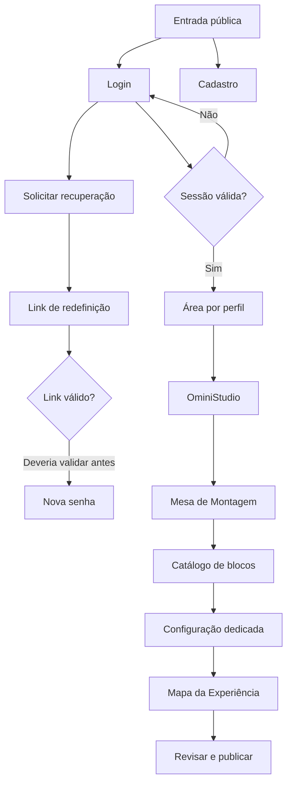
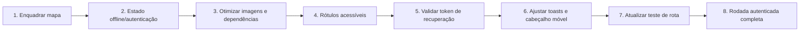

# Auditoria de UX — OminiSaber

**Data:** 01/10/2026  
**Ambiente:** aplicação local em `http://127.0.0.1:4173` e pacote `netlify-dist`  
**Escopo executado:** superfícies públicas, proteção das áreas autenticadas, responsividade do login e do OminiStudio, fluxo local de criação por blocos, mapa, análise estática de 79 páginas principais, integridade de 97 rotas HTML, recursos e testes automatizados existentes.

> Limite importante: não havia uma sessão autenticada nem credenciais de teste disponíveis. Por isso, esta rodada não confirma os fluxos reais de aluno, professor, gestor e bibliotecária que leem ou gravam dados no Supabase. As rotas protegidas redirecionaram corretamente para o login. Uma segunda rodada autenticada é necessária para chamar o produto inteiro de validado de ponta a ponta.

## Status após as correções críticas

Os achados P1 e os itens P2 de maior impacto deste relatório foram tratados em 01/10/2026. A validação pós-correção confirmou:

- **97/97 rotas HTML** válidas no pacote final `netlify-dist`;
- **17/17 testes críticos e de navegação** aprovados;
- **5/5 testes de hospedagem do OminiStudio** aprovados;
- **0 achados** na nova varredura estática das 79 páginas principais;
- mapa do OminiStudio com enquadramento automático, comando manual de reenquadramento e layout móvel validado em 375 × 812;
- estado de sessão expirada compreensível, com entrada novamente e exportação do rascunho;
- recuperação de senha bloqueada até a validação do link;
- imagens de uso real otimizadas e carregamento preguiçoso aplicado nas vitrines;
- cliente Supabase empacotado localmente e cadastro sem Tailwind em modo CDN;
- rótulos acessíveis adicionados aos controles apontados;
- toasts móveis reposicionados para não cobrir campos.

O limite de validação autenticada permanece: criação, envio, correção e recuperação com dados reais do Supabase precisam de uma conta de teste válida para uma auditoria ponta a ponta.
Como melhoria não bloqueante, o site ainda pode empacotar localmente as fontes do Google; os clientes Supabase e Tailwind que afetavam execução e estabilidade já não dependem de CDN.

> As seções abaixo preservam o diagnóstico original para rastreabilidade. As recomendações nelas descritas devem ser lidas em conjunto com o status pós-correção acima.

## Resumo executivo

O produto está visualmente consistente e já possui uma boa base de acessibilidade e responsividade. Todas as 97 páginas HTML encontradas responderam sem 404 no servidor local; o pacote do OminiStudio passou nos cinco testes de hospedagem; e 13 de 14 testes funcionais selecionados passaram.

Ainda não recomendo tratar o MVP como “sem riscos” para um teste amplo. Há quatro grupos que merecem correção antes disso:

1. **Mapa do OminiStudio em celular/tablet:** o enquadramento inicial usa coordenadas fixas e deixa etapas fora da área útil, tornando o percurso difícil de compreender e editar.
2. **Estado de autenticação do OminiStudio:** sem sessão, o usuário entra no estúdio e recebe mensagens como “Auth session missing!” ou “Rascunho local · nuvem indisponível”. É possível trabalhar localmente, mas não publicar; a fronteira entre modo offline, sessão expirada e erro não está clara.
3. **Desempenho em conexões móveis:** existem sete imagens-fonte acima de 1 MiB, algumas com mais de 3 MiB, sem carregamento preguiçoso nas vitrines de trilhas. Há também dependência ampla de CDNs externas.
4. **Acessibilidade de formulários:** foram confirmados controles sem nome programático em uma oficina de redação e na busca da gestão de empréstimos.

## Saúde por área

| Área | Estado | Evidência principal |
|---|---|---|
| Rotas HTML locais | Saudável | 97/97 responderam com status válido |
| Proteção de rotas | Saudável nesta amostra | aluno, professor e gestor redirecionaram ao login sem sessão |
| Login desktop | Bom, com ressalva de altura | formulário claro, validação acessível e foco no erro |
| Login móvel | Bom | 375 × 812 mantém formulário e CTA utilizáveis |
| Cadastro | Atenção | formulário longo e Tailwind carregado em modo CDN de desenvolvimento |
| Recuperação de senha | Problema de confiança | formulário aparece sem validar previamente o link/sessão de recuperação |
| OminiStudio desktop | Bom | hierarquia clara, sidebar funcional e entrada compreensível |
| Catálogo/configuração móvel | Bom | conteúdo empilhado e ações preservadas |
| Mapa móvel/tablet | Crítico | etapas aparecem cortadas e dispersas; não há ajuste automático ao conjunto |
| Fluxos autenticados reais | Não verificado | ausência de conta/sessão de teste |

## Achados priorizados

### P1 — corrigir antes do teste amplo

#### 1. O mapa não enquadra o percurso em telas estreitas

- **Onde:** OminiStudio → Mapa da Experiência, em 520 × 900 e 768 × 1024.
- **O que acontece:** parte das etapas nasce fora da área visível; o usuário encontra conexões sem origem ou destino aparentes e precisa descobrir manualmente onde estão os blocos.
- **Causa provável confirmada no código:** `MapCanvas.jsx` usa `setViewport` com posições e zoom fixos no `onInit`, em vez de `fitView` calculado a partir dos nós. O breakpoint móvel também elimina o minimapa abaixo de 480 px.
- **Impacto:** professor pode interpretar que blocos desapareceram, perder contexto e montar ligações erradas.
- **Correção recomendada:** usar `fitView({ padding, nodes })` na abertura e após alterações relevantes; oferecer “Enquadrar percurso” sempre visível; preservar a posição escolhida pelo usuário somente depois do primeiro enquadramento; aplicar zoom mínimo diferente conforme quantidade e dispersão dos nós.
- **Evidências:** [mobile](evidencias/09-oministudio-mapa-mobile.png) e [tablet](evidencias/10-oministudio-mapa-tablet.png).

#### 2. O estado sem autenticação do OminiStudio é ambíguo

- **Onde:** entrada direta em `/netlify-dist/oministudio/` sem sessão.
- **O que acontece:** a interface de professor abre, o usuário consegue editar um rascunho local e recebe mensagens técnicas ou pouco acionáveis. Publicar fica bloqueado apenas mais adiante.
- **Impacto:** risco de o professor investir tempo em um conteúdo que não será sincronizado; sensação de falha ou perda de dados.
- **Correção recomendada:** antes de abrir o estúdio, apresentar um estado explícito com três escolhas: “Entrar novamente”, “Continuar offline neste dispositivo” e “Voltar ao painel”. Em modo offline, manter um banner persistente com explicação do que não será salvo/publicado. Traduzir mensagens técnicas.
- **Evidências:** [entrada móvel](evidencias/06-oministudio-mobile-choose.png) e [entrada desktop](evidencias/11-oministudio-desktop-choose.png).

#### 3. Imagens pesadas comprometem o primeiro carregamento no celular

- **Onde:** login e vitrines de trilhas de Matemática e Português.
- **Dados:** sete imagens-fonte acima de 1 MiB; duas imagens de Português têm aproximadamente 3,1 MiB cada; a arte do login tem 1,25 MiB. As imagens das vitrines não usam `loading="lazy"`.
- **Impacto:** maior tempo de tela vazia, consumo de dados e instabilidade visual em redes escolares/móveis.
- **Correção recomendada:** exportar WebP/AVIF responsivo, usar `srcset`/`sizes`, dimensões explícitas e `loading="lazy"` fora da primeira dobra. Para a arte principal do login, usar preload apenas da variante adequada ao viewport.
- **Dados completos:** [inventário de recursos](dados/asset-inventory.json).

#### 4. Dois campos confirmados não possuem nome acessível

- **Onde:** `frontend/aluno/modulo_de_trilhas/redacao/index.html` (área de tese) e `frontend/bibliotecaria/gestao_emprestimos/index.html` (busca de registros).
- **O que acontece:** os controles dependem exclusivamente de texto visual/placeholder.
- **Impacto:** leitores de tela anunciam controles sem finalidade clara; placeholder desaparece durante a digitação.
- **Correção recomendada:** adicionar `<label for>` visível ou `aria-label`/`aria-labelledby` apropriado. Não usar placeholder como rótulo.
- **Observação:** o scanner também sinalizou um upload de PDF, mas a inspeção manual confirmou que ele está dentro de um `<label>` com texto; esse item foi descartado como falso positivo.

### P2 — corrigir na sequência

#### 5. A redefinição de senha pede uma nova senha antes de validar o link

- **Onde:** acesso direto a `frontend/redefinir-senha/index.html` sem fluxo de recuperação.
- **O que acontece:** o formulário completo aparece normalmente; a invalidez só é descoberta depois de o usuário preencher e enviar.
- **Impacto:** perda de tempo e quebra de confiança em um fluxo sensível.
- **Correção recomendada:** validar a sessão/evento de recuperação no carregamento; exibir “link inválido ou expirado” imediatamente e CTA para solicitar outro link.
- **Evidência:** [redefinição sem token](evidencias/04-redefinir-senha.png).

#### 6. Dependência de fontes e ícones externos pode degradar a interface

- **Onde:** 68 páginas usam Google Fonts; 86 páginas carregam o cliente Supabase via jsDelivr; o cadastro usa Tailwind por CDN.
- **O que foi observado:** em uma captura móvel, o símbolo baseado em fonte apareceu como texto antes de normalizar em nova carga. O console do cadastro registra o aviso de que `cdn.tailwindcss.com` não deve ser usado em produção.
- **Impacto:** ícones ilegíveis e layout instável quando a rede/CDN falha; maior latência e superfície de indisponibilidade.
- **Correção recomendada:** empacotar fontes/ícones críticos e o cliente Supabase; compilar o CSS do cadastro no build; manter fallback SVG para ícones essenciais.
- **Evidências:** [captura com degradação](evidencias/05-login-mobile-520.png) e [captura estabilizada](evidencias/12-login-mobile-375.png).

#### 7. Toasts podem cobrir campos em telas pequenas

- **Onde:** página de configuração de bloco do OminiStudio.
- **O que acontece:** aviso fixo no rodapé se sobrepõe temporariamente à área editável.
- **Impacto:** oculta instruções e dificulta revisão do texto.
- **Correção recomendada:** reservar espaço para mensagens, posicioná-las abaixo do cabeçalho em telas pequenas ou torná-las dispensáveis sem bloquear conteúdo.
- **Evidência:** [configuração móvel](evidencias/08-oministudio-config-mobile.png).

#### 8. Um teste automatizado está desatualizado após a correção de rota

- **Onde:** teste de navegação do portal do professor.
- **O que acontece:** espera o caminho antigo `/engine/dist/client/index.html`, enquanto a implementação agora usa o caminho publicado `/oministudio/`.
- **Impacto:** pipeline vermelho por falso positivo e risco de a equipe ignorar falhas reais.
- **Correção recomendada:** atualizar o contrato do teste para `/oministudio/` e manter uma asserção separada sobre `returnTo` e `teacherType`.

#### 9. Cabeçalho do OminiStudio fica denso no celular

- **Onde:** mesa, mapa e configuração abaixo de 520 px.
- **O que acontece:** voltar ao painel, testar e publicar disputam espaço e quebram em mais de uma linha.
- **Impacto:** foco visual difuso e maior chance de toque no comando errado.
- **Correção recomendada:** manter uma ação primária; agrupar as secundárias em menu “Mais”; esconder estado de salvamento textual em favor de ícone com rótulo acessível.
- **Evidência:** [catálogo móvel](evidencias/07-oministudio-catalogo-mobile.png).

### P3 — refinamentos

#### 10. Cadastro usa pouco o espaço desktop e exige rolagem longa

- **Onde:** cadastro desktop.
- **Impacto:** sensação de formulário mais trabalhoso do que realmente é.
- **Sugestão:** agrupar campos relacionados em duas colunas acima de 900 px e manter uma coluna no celular; incluir progresso curto (“Conta”, “Perfil”, “Confirmação”) se mais campos forem adicionados.
- **Evidência:** [cadastro desktop](evidencias/03-cadastro-desktop.png).

#### 11. A página de redefinição usa linguagem visual diferente

- **Onde:** botão roxo e composição da redefinição de senha versus azul principal do login.
- **Impacto:** pequena quebra de continuidade em um fluxo de confiança.
- **Sugestão:** reutilizar tokens, componentes e feedback do login.

## Pontos positivos confirmados

- O login possui link de salto visível ao receber foco, foco claro, rótulos programáticos e erro com `role="alert"` e `aria-live="assertive"`.
- O link “Esqueci minha senha” possui lógica funcional: exige e-mail válido, envia solicitação e usa mensagem neutra contra enumeração de contas. O `href="#"` é apenas uma fragilidade semântica menor, não um link quebrado.
- As áreas protegidas de aluno, professor e gestor redirecionam visitantes sem sessão ao login.
- O catálogo e a página dedicada de configuração de blocos se reorganizam bem no celular.
- As 97 rotas HTML encontradas possuem resposta local válida; o scanner das 79 páginas principais não encontrou referências locais quebradas.
- As 79 páginas do rastreio estático não apresentaram ausência de `lang`, `viewport` ou `title`, nem imagens sem `alt`.
- A entrada desktop do OminiStudio tem boa hierarquia, CTAs claros e sidebar legível.

## Jornada testada

### Etapas executadas e resultado

1. **Abrir login desktop** — saudável; hierarquia e formulário claros. [Evidência](evidencias/01-login-desktop.png)
2. **Enviar login vazio** — saudável; erro anunciado e foco transferido ao alerta. [Evidência](evidencias/02-login-validation.png)
3. **Abrir cadastro desktop** — funcional, com ressalvas de densidade e CDN. [Evidência](evidencias/03-cadastro-desktop.png)
4. **Abrir redefinição sem token** — problema: formulário exibido antes da validação. [Evidência](evidencias/04-redefinir-senha.png)
5. **Validar login em 520 px e 375 px** — funcional; uma carga apresentou degradação temporária do ícone externo. [520 px](evidencias/05-login-mobile-520.png) · [375 px](evidencias/12-login-mobile-375.png)
6. **Navegar por teclado no login** — saudável; link de salto é o primeiro foco e fica visível. [Evidência](evidencias/13-login-mobile-skip-focus.png)
7. **Tentar rotas protegidas** — saudável; aluno, professor e gestor retornam ao login sem sessão.
8. **Abrir OminiStudio sem sessão** — funcional como rascunho local, mas estado e limites pouco claros. [Evidência](evidencias/06-oministudio-mobile-choose.png)
9. **Abrir mesa e catálogo de blocos** — saudável no celular. [Evidência](evidencias/07-oministudio-catalogo-mobile.png)
10. **Adicionar bloco “Fórmula química” e abrir configuração dedicada** — funcional; conteúdo responsivo, toast sobrepõe parte da edição. [Evidência](evidencias/08-oministudio-config-mobile.png)
11. **Abrir mapa em celular** — problema crítico de enquadramento. [Evidência](evidencias/09-oministudio-mapa-mobile.png)
12. **Abrir mapa em tablet** — problema reproduzido; nós permanecem cortados/dispersos. [Evidência](evidencias/10-oministudio-mapa-tablet.png)
13. **Reabrir entrada em desktop** — saudável visualmente; modo local é indicado no topo. [Evidência](evidencias/11-oministudio-desktop-choose.png)
14. **Verificar rotas em massa** — 97/97 responderam; detalhes em [route-health.json](dados/route-health.json).
15. **Executar testes selecionados** — 13/14 passaram; a única falha é a expectativa antiga da rota do OminiStudio.
16. **Executar testes de hospedagem do engine** — 5/5 passaram.

## Cobertura ainda necessária com contas de teste

Para fechar a auditoria de ponta a ponta, a próxima rodada deve usar ao menos uma conta de cada perfil e dados descartáveis:

- aluno: receber, iniciar, salvar, enviar e reabrir atividade; trilhas; agenda; notificações; biblioteca; redação; estados vazio/erro/offline;
- professor: criar/publicar atividade, receber tentativa, corrigir/ajustar nota, recuperação, agenda, OminiStudio sincronizado;
- gestor: criar turma/aluno/professor/vínculo/descritor, editar e excluir com segurança, auditoria e permissões;
- bibliotecária: cadastro, busca, empréstimo, devolução, reserva, leitura de código e publicação de PDF;
- Supabase: políticas por perfil, perda/renovação de sessão, concorrência, mensagens de erro e dados entre contas;
- dispositivos: Chrome/Edge desktop, Android Chrome e ao menos uma verificação em Safari/iOS real ou serviço equivalente;
- rede: 3G lento, offline, CDN indisponível e retomada da conexão.

## Ordem recomendada de correção

## Arquivos de apoio

- [Resultado do scanner estático](dados/auditoria-estatica.json)
- [Saúde das 97 rotas](dados/route-health.json)
- [Inventário de recursos e tamanhos](dados/asset-inventory.json)
- [Pasta de evidências](evidencias/)

## Conclusão

O OminiSaber está em condição de demonstração controlada nas superfícies verificadas, mas ainda não está tecnicamente validado como MVP completo. O maior defeito de uso reproduzido é o mapa em telas estreitas; o maior risco operacional é o usuário trabalhar no OminiStudio sem entender que está fora da nuvem; e o maior risco de desempenho são as imagens grandes e dependências remotas. Após essas correções, é indispensável executar a segunda rodada autenticada com contas descartáveis antes de um teste real com alunos e professores.
