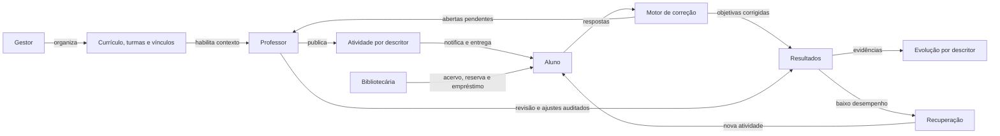
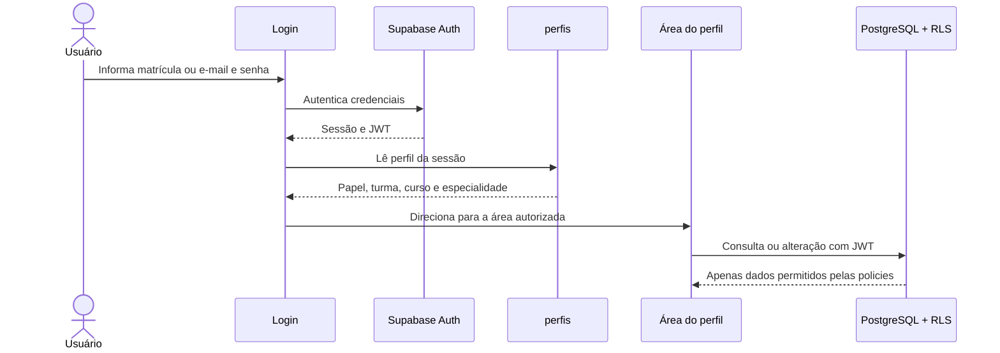
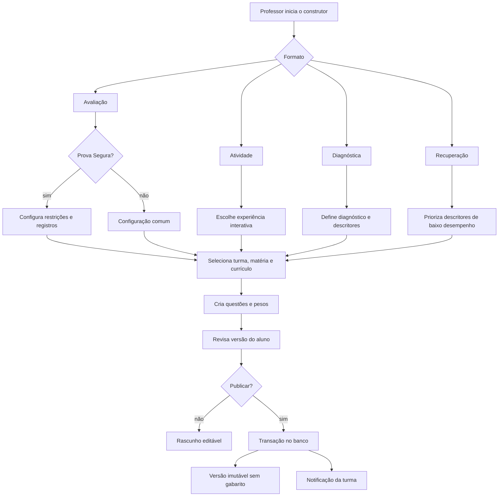
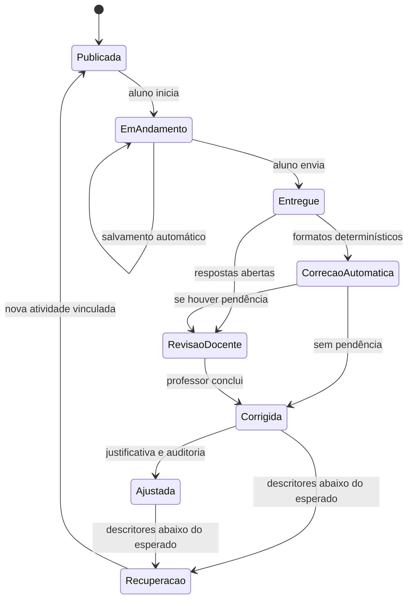
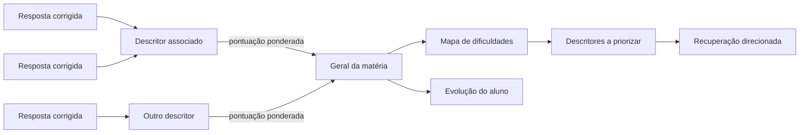
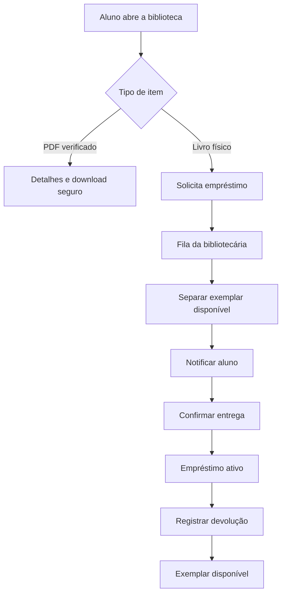
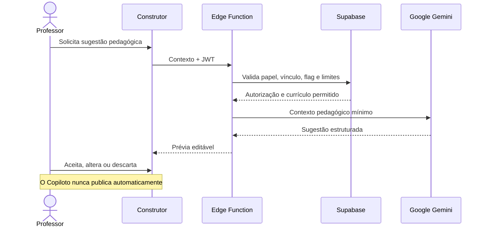

# Fluxogramas do OminiSaber

Atualizado em **9 de setembro de 2026**.

Este documento representa os fluxos funcionais vigentes. As setas mostram troca de
dados ou mudança de estado; elas não substituem as permissões do banco. Toda leitura
ou gravação exposta ao navegador continua sujeita a RLS.

## Visão do sistema por perfil

## Autenticação, perfil e autorização

O redirecionamento melhora a experiência, mas não é uma barreira de segurança. A
autorização real está nas policies e nas funções que validam `auth.uid()`, papel,
turma, matéria e vínculo.

## Criação e publicação de atividade

## Execução, correção e recuperação

## Resultado agregado do aluno

Percentuais são calculados somente a partir de respostas reais corrigidas. A
ausência de evidência deve aparecer como “sem evidência”, nunca como zero inventado.

## Biblioteca física e digital

## Copiloto docente

## Fontes de verdade

- instalação limpa do banco: `backend/ominisaber-schema-completo.sql`;
- evolução incremental: `backend/migrations/`;
- cliente e páginas: `backend/` e `frontend/`;
- contratos do motor: `docs/modules/motor-atividades/README.md`;
- situação verificada: `docs/development/auditoria-sistema-2026-09-09.md`.
