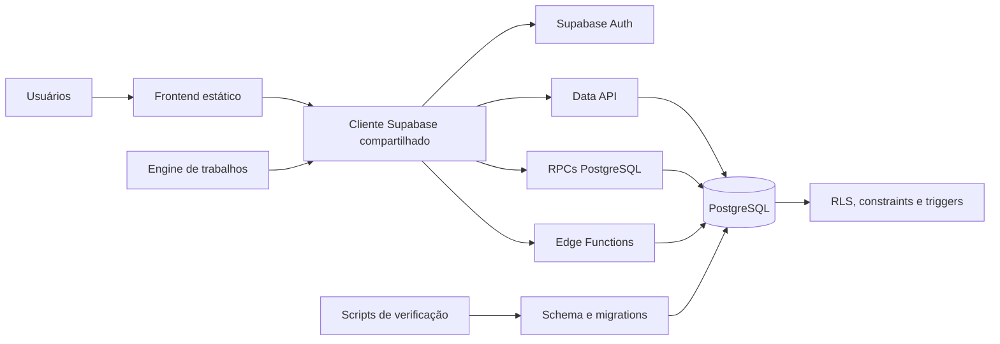
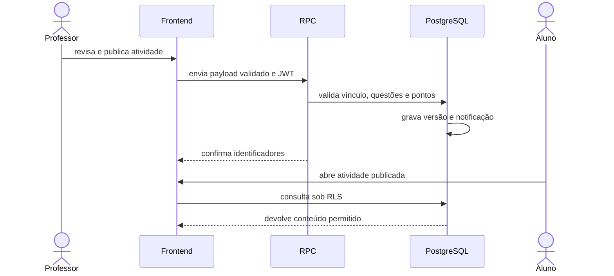
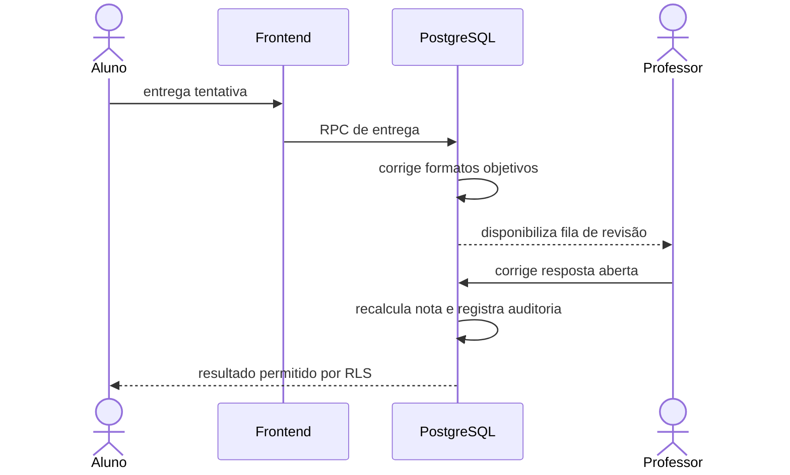

# Diagrama de Componentes

| Campo | Valor |
| --- | --- |
| Código | OMNI-TEC-ARC-002 |
| Versão | v1.0 |
| Status | Ativo |
| Classificação | Uso Interno |
| Público / responsável | Técnico |
| Criação / revisão | 2026-09-25 |

## Responsabilidades

| Componente | Responsabilidade | Não deve fazer |
| --- | --- | --- |
| Frontend | interação, validação de entrada e apresentação | decidir autorização ou conter secrets |
| Cliente compartilhado | sessão e acesso consistente aos contratos | contornar RLS |
| Auth | identidade e tokens | armazenar regras pedagógicas em metadata editável pelo usuário |
| Data API | acesso às tabelas com grants e RLS | expor tabelas internas |
| RPCs | operações atômicas e validações de domínio | confiar apenas em parâmetros do cliente |
| Edge Functions | integrações e operações com secrets | devolver chaves ou dados excessivos |
| PostgreSQL | integridade, autorização e auditoria | depender de filtros do frontend |

Detalhes de sequência estão em [Fluxogramas](../../architecture/fluxogramas.md).

## Visões por contexto

**Contexto de identidade.** O navegador autentica no Supabase Auth. O JWT identifica
o usuário, enquanto `perfis`, vínculos docentes e policies definem seu escopo. Uma
rota visível não concede permissão por si mesma.

**Contexto pedagógico.** Currículo, avaliações, tentativas, respostas e resultados
formam o núcleo transacional. Gabaritos ficam separados de questões públicas. Uma
publicação produz uma versão estável para evitar que edições futuras alterem uma
tentativa já iniciada.

**Contexto operacional.** Agenda e notificações divulgam compromissos e publicações.
Biblioteca controla material digital, exemplares e solicitações. Edge Functions
executam operações que precisam de secrets ou privilégios administrativos.

## Sequência de publicação

## Sequência de correção

## Dependências e falhas

Se Auth estiver indisponível, novas sessões e operações protegidas param. Se a Data
API falhar, a interface deve mostrar erro e preservar entradas locais que possam ser
reenviadas com segurança. Falha de Edge Function não autoriza fallback no navegador
com uma chave elevada. Falha de notificação não deve desfazer a publicação; deve ser
detectável e reconciliável.

## Regras de alteração

Novos componentes devem declarar responsável, dados tratados, autenticação,
dependências, comportamento de falha, logs e testes. Qualquer nova seta que atravesse
um limite de confiança exige revisão de segurança e atualização deste diagrama.
