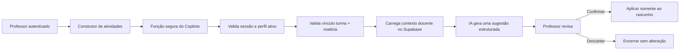

# Copiloto docente — contexto conectado ao Supabase

## Objetivo

Esta fundação conecta o Copiloto aos dados pedagógicos que já pertencem ao professor no OminiSaber. O objetivo é produzir rascunhos mais adequados à turma sem expor dados pessoais dos alunos e sem retirar do professor o controle sobre publicação, notas ou percurso pedagógico.

## Fluxo

## Dados usados pela IA

- especialidade do professor;
- turma, série e ano letivo selecionados;
- matéria e descritores curriculares selecionados;
- até seis atividades recentes do próprio professor para a mesma turma e matéria;
- formatos e quantidade de questões dessas atividades;
- até cinco trilhas recentes do próprio professor para a mesma turma e matéria;
- quantidade de tentativas enviadas/corrigidas, revisões pendentes e média percentual agregada.
- experiências publicadas pelo próprio professor para a turma no OmniStudio: título, objetivo, quantidade e tipos de blocos;
- desempenho agregado de até 500 tentativas recentes dessas experiências, calculado somente com tentativas corrigidas.

## Dados que não são enviados

- nome, matrícula, e-mail ou identificador do aluno;
- respostas individuais;
- feedback individual;
- documentos, telefone ou qualquer outro dado pessoal;
- gabaritos de atividades anteriores.

A consulta de desempenho seleciona somente `avaliacao_id`, `status`, `nota` e `requer_revisao`. Os valores são agregados antes da chamada de IA.

## Controles de segurança e qualidade

- a função exige JWT e revalida o usuário no Supabase Auth;
- somente professores ativos podem usar o recurso;
- turma, matéria e descritores são validados no servidor;
- a chave do provedor de IA existe somente como segredo da função;
- a chamada usa saída JSON estruturada e `store: false`;
- existem limites por minuto e por dia;
- a sugestão nunca é publicada automaticamente;
- aplicar a sugestão altera somente o rascunho aberto;
- a execução guarda auditoria, latência e consumo, sem incluir dados pessoais de alunos;
- o recurso permanece atrás da flag `professor_copiloto`.

## Interface

Depois que a sugestão é criada, a interface confirma que o contexto veio do Supabase e informa:

- a turma validada;
- a quantidade de atividades recentes consideradas;
- a quantidade de trilhas recentes consideradas;
- a ausência de dados pessoais de alunos no contexto.

## Próximas capacidades previstas

1. gerar atividades completas a partir de objetivo e descritores;
2. revisar uma atividade existente;
3. sugerir recuperação a partir de resultados agregados;
4. sugerir trilhas de aprendizagem;
5. criar ferramentas explícitas para salvar rascunhos, sempre com confirmação do professor.

As capacidades de escrita devem continuar separadas da geração: primeiro a IA propõe, depois o professor revisa e somente então autoriza a alteração.

## Integração autoral com o OmniStudio

O OmniStudio usa a mesma função protegida `professor-copiloto` e a mesma flag de acesso do portal docente. O pedido envia `format: "studio-interativo"`, a turma vinculada, a intenção pedagógica, o trimestre, os descritores opcionais e a escolha explícita sobre os indicadores agregados.

A função agora gera `suggestion.studioExperience` com blocos executáveis de conteúdo, escolha, resposta numérica, resposta aberta, ordenação e associação. O servidor valida gabaritos, intervalos, rubricas, pontuações, pares únicos e vínculos curriculares, cria identificadores seguros e conecta o percurso. Ordenação usa um item por linha na ordem correta; associação usa `Termo | Correspondente` por linha. O snapshot publicado embaralha os itens e protege os gabaritos.

O professor vê todas as instruções, gabaritos e critérios antes de aplicar, pode refinar o pedido e adicionar a proposta ao percurso atual. A opção de substituição exige uma confirmação explícita e cria uma nova identidade de experiência; adicionar preserva o trabalho e suas ramificações. A proposta permanece no rascunho até a revisão, o teste e a publicação normal do estúdio.

Enquanto o novo código da função não for implantado, o conversor aceita o retorno legado `suggestion.activity`: alternativas válidas viram escolhas, gabaritos numéricos inequívocos viram respostas numéricas e questões que exigem interpretação ficam sob revisão humana. Formatos e gabaritos inconsistentes impedem a aplicação.

O pedido de revisão envia apenas campos pedagógicos permitidos. Nomes, respostas de alunos, URLs e objetos arbitrários não entram em `currentStudio`. Quando a análise da turma não é autorizada, nenhuma consulta de atividades, trilhas, experiências ou tentativas é realizada. Médias da avaliação clássica também ignoram notas nulas e tentativas ainda não corrigidas.

A chamada ao provedor utiliza instrução de sistema separada dos dados, saída estruturada, `store: false` e um limite de 60 segundos. Indisponibilidade, excesso de pedidos, atraso e propostas inválidas retornam mensagens legíveis, preservando o rascunho.

Validação local: `node --test backend/scripts/test-copilot-contract.mjs` (contrato, privacidade e consultas agregadas com dados simulados), `node --test engine/tests/copilot-work.test.mjs` (conversão e preservação dos percursos) e `npm --prefix backend run copilot:check`. Esses testes não executam uma geração paga nem alteram o projeto remoto. A geração nativa depende da implantação do código atualizado da função.

## Implantação

### Estado validado em 03/10/2026

- migrações de tabelas, políticas e flag aplicadas no projeto `ominisaber`;
- código da função `professor-copiloto` atualizado localmente; o deploy deve ser
  confirmado após a publicação no projeto remoto;
- `ALLOWED_ORIGINS`, `GEMINI_API_KEY` e `GEMINI_MODEL` configurados como segredos;
- endpoint remoto validado: uma chamada sem sessão retorna `401` e não executa a geração;
- a flag global `professor_copiloto` permanece desabilitada por segurança;
- a conta-piloto do professor de Português está habilitada individualmente;
- provedor configurado como Google Gemini, usando saída JSON estruturada;
- o ambiente de teste foi saneado e recebeu 30 alunos sintéticos na turma do
  professor de Português;
- o Copiloto agora pode escolher habilidades compatíveis automaticamente, gerar
  trilhas de aprendizagem e direcionar a atividade para todas as turmas do
  professor;
- a sugestão permaneceu como rascunho para revisão, sem publicação automática.

Antes de liberar a flag para professores:

1. publicar a função `professor-copiloto` no projeto Supabase correto;
2. configurar `GEMINI_API_KEY`, `GEMINI_MODEL` e `ALLOWED_ORIGINS` como segredos da função;
3. executar a validação automatizada `npm --prefix backend run copilot:check`;
4. habilitar a flag inicialmente para uma conta piloto;
5. realizar um teste completo de geração, revisão, aplicação ao rascunho e feedback;
6. liberar gradualmente para os demais professores.

## Consentimento de contexto na interface

O assistente flutuante usa três etapas explícitas: **Pedido → Contexto → Rascunho**. Antes de consultar indicadores pedagógicos, o professor escolhe entre:

- **usar dados agregados**: a função consulta atividades recentes, trilhas e resultados consolidados da turma;
- **criar sem analisar**: a função valida apenas turma, matéria e descritores, sem consultar tentativas, desempenho ou histórico recente.

A escolha é enviada como `useClassContext` e reaplicada no servidor. Portanto, esconder os dados na interface não é o único controle: quando o consentimento é recusado, as consultas analíticas também deixam de ser executadas pela Edge Function.

Em ambos os caminhos, a resposta continua sendo apenas um rascunho. O professor precisa revisar e usar **Aplicar ao rascunho** antes que qualquer conteúdo entre no editor da atividade.

