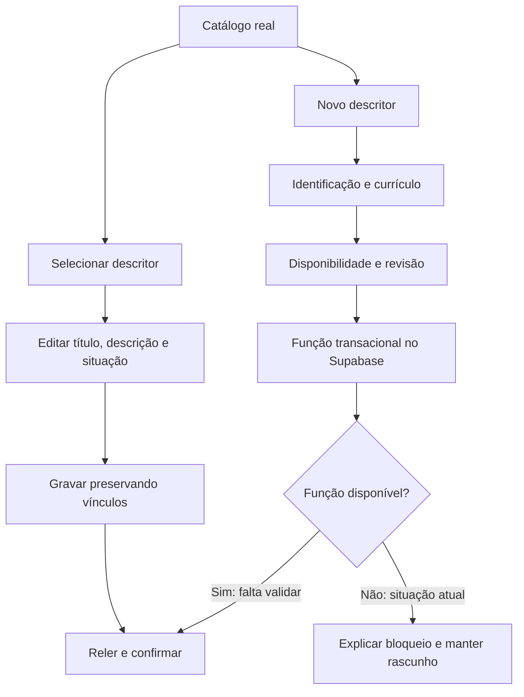

# Mesa curricular — implementação e validação

Data: 29/09/2026. Estado: interface implementada; criação remota bloqueada por função ausente.

## Decisão de interface

A edição usa catálogo pesquisável, formulário permanente e pré-visualização. A criação recolhe o catálogo e divide o trabalho em Identificação, Currículo, Disponibilidade e Revisão. A escolha adapta a referência visual à navegação e aos componentes curriculares reais do sistema, sem redesenhar outros módulos.

No celular e tablet, o formulário usa uma coluna. Catálogo acessível por botão; pré-visualização abaixo do formulário. Campos têm rótulos, foco visível, controles de toque e aviso de alterações não salvas. Em 320 px, as etapas mostram números, mantendo os nomes acessíveis.

## Integração

- Leitura autenticada de `descritores_curriculares`, `habilidade_descritores` e `descritor_curriculo_periodos`.
- Habilidades consultadas pelo serviço curricular existente, conforme componente, série e trimestre. Seis habilidades reais foram retornadas no cenário Português / 1ª série / 1º trimestre.
- Edição preserva código, componente, períodos e relações existentes; grava somente título, descrição, situação e atualização temporal. O filtro `updated_at` detecta conflito de edição.
- O formulário relê o catálogo após gravar e só confirma sucesso quando título e descrição correspondem ao solicitado.
- Criação envia nomes de campos em português à função `salvar_descritores_curriculares_lote`. O código anterior enviava nomes incompatíveis.
- Rascunhos de criação ficam no navegador, separados pelo identificador do usuário. Não são sincronizados com a nuvem. Sem armazenamento local, a interface avisa explicitamente.
- Ativação de um novo cadastro exige vínculo com habilidade publicada. A política existente não torna um descritor visível ao professor apenas por marcar `ativo`.
- Não foram alteradas RLS, grants ou chaves públicas. Nenhuma chave privilegiada foi adicionada ao navegador.

## Bloqueio confirmado

O teste real de criação retornou: `Could not find the function public.salvar_descritores_curriculares_lote(p_descritores) in the schema cache`.

O cadastro D999_P não foi criado; permanece apenas como rascunho local de teste. A tela apresenta explicação em português e permite retomar os dados. Não há fallback que grave descritor e relações separadamente e possa deixar cadastro parcial.

O plugin Supabase não expôs ferramenta SQL nesta sessão. Não foi possível implantar ou validar a função remota. A migração existente `backend/migrations/20260905_descritores_manual_fase2.sql` precisa ser revisada antes da implantação: contém variáveis com nomes iguais a colunas e uma função de edição que apaga relações. Não aplicar cegamente. A edição nova não chama essa função destrutiva.

A auditoria transacional das edições também permanece pendente de validação/implantação no banco. A atualização direta não afirma gerar eventos em `gestor_auditoria`.

## Testes executados

| Teste | Resultado |
| --- | --- |
| Carregar catálogo real | 55 descritores |
| Consultar habilidades por período | Aprovado |
| Navegar nas quatro etapas e pré-visualizar | Aprovado |
| Recarregar e retomar rascunho | Aprovado |
| Salvar cadastro existente sem alterar conteúdo | Supabase retornou sucesso; releitura confirmou conteúdo |
| Criar D999_P | Bloqueado pela função ausente; nenhum sucesso artificial |
| Desktop 1440 px | Sem overflow horizontal: documento 1425 px |
| Tablet 768 px | Sem overflow horizontal: documento 753 px |
| Celular 390 px | Sem overflow horizontal: documento 375 px |
| Celular 320 px | Corrigido overflow das etapas: documento 305 px |
| Erros de console na última página carregada | Nenhum capturado |
| Contratos locais | Aprovados: payload, proteção de relações, timestamp, conflito, função ausente, guarda do gestor |

Comando dos contratos: `node backend/scripts/test-descriptor-studio-contract.cjs`. São testes com cliente simulado; não substituem testes de RLS no banco. O script de consulta real usa credenciais fornecidas por variáveis de ambiente, sem senha fixa no código.

## Próxima liberação

1. Disponibilizar acesso SQL ao projeto Supabase correto.
2. Revisar e implantar função transacional de criação e auditoria, mantendo políticas restritas.
3. Criar um registro de teste, confirmar relações, editar e reler.
4. Validar visibilidade com conta de professor e negação de escrita com conta de aluno.
5. Arquivar o registro de teste e registrar evidências. Esses passos ainda não foram concluídos.

## Evidências

- `evidence/descriptor-desktop.png`
- `evidence/descriptor-creation.png`
- `evidence/descriptor-mobile.png`
- `evidence/descriptor-tablet.png`

